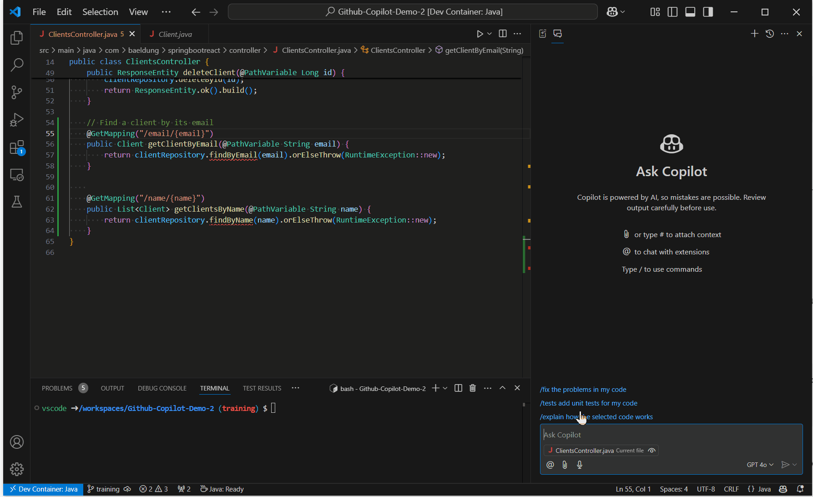

## Guide de la démonstration live GitHub Copilot

### 1. Génération de code / fonction à partir d'une description

**Objectif :** Ajouter la fonctionnalité `findByEmail` dans le contrôleur.

```java
// Find a client by its email
```


**Commentaire :** Copilot peut générer des fonctions complètes à partir de simples descriptions en langage naturel.

### 2. Auto-complétion

**Objectif :** Ajouter la fonctionnalité `findByName dans le contrôleur.

```java
@GetMapping("/name/{name}")
```


**Commentaire :** Cette commande montre comment Copilot peut suggérer des annotations et des méthodes basées sur le contexte de ton code.

### 3. Documentation automatique de code

**Objectif :** Utiliser Copilot pour générer automatiquement des commentaires et de la documentation pour le code.

#### Une seule méthode


#### Plusieurs méthodes visibles uniquement à l'écran

> Montrer la différence entre Visual Studio Code et IntelliJ.
> Dans Visual Studio Code, Copilot travaille uniquement sur les méthodes visibles à l'écran.
> Dans IntelliJ, Copilot travaille sur toutes les méthodes de la classe.

```
Generate the documentation for all methods.
```



#### Toutes les méthodes de la classe

```
Generate the documentation for all methods.
```


**Commentaire :** Copilot peut aider à documenter le code en générant des commentaires et des descriptions basées sur le contexte du code.

### 4. Génération de tests unitaires

**Objectif :** Générer des tests unitaires pour le code existant.

- Afficher la classe `SpringBootReactApplication.java` et cliquer dans le chat sur `/tests add unit tests for my code`.


**Commentaire :** Cette commande permet de générer automatiquement des tests unitaires pour le code existant.

- Créer le fichier `ClientsControllerTests.java` et générer les tests avec edits.

> **Prompt à utiliser :** `generate unit tests for ClientsController.`


**Commentaire :** Copilot peut aider à créer des fichiers de tests et à générer des tests unitaires, mais il est important de vérifier et d'éditer les tests générés pour s'assurer de leur exactitude.

- Constater que la génération de beaucoup de code à la fois peut générer plus d'erreurs.

**Commentaire :** Il est important de noter que la génération automatique de code peut parfois introduire des erreurs, il est donc crucial de toujours revoir le code généré.

- Ajouter les methodes manquantes dans ClientRepository avec Edits

> **Prompt à utiliser :** `Add missing methods in ClientRepository.`


### 5. Correction de bug

**Objectif :** Utiliser Copilot pour expliquer et corriger des erreurs de code.

- Exécuter la commande `mvn clean verify` et constater le bug `java.lang.IllegalArgumentException: Name for argument of type [java.lang.String] not specified, and parameter name information not available via reflection. Ensure that the compiler uses the '-parameters' flag.`

> **Prompt à utiliser :** `@terminal /explain build failure` et `Can you provide more details about this error?`


**Commentaire :** Copilot peut expliquer les erreurs de code et fournir des suggestions pour les corriger.

### 6. Explication de code

**Objectif :** Utiliser Copilot pour expliquer des avertissements ou des erreurs dans le code.

- Warning sur `ResponseEntity` dans `ClientsController`.

> **Prompt à utiliser :** `/explain` Why is there a warning on ResponseEntity ?


**Commentaire :** Copilot peut fournir des explications détaillées sur les avertissements et les erreurs dans le code, aidant ainsi à mieux comprendre et résoudre les problèmes.

### 8. Utilisation de Edits

**Objectif :** Utiliser Edits pour générer du code.

Demander à Copilot de séparer l'attribut `name` en `firstName` et `lastName`.

```
Split the name of the client in two attributes: firstname and lastname. Add the documentation as well Explain what you and don't show the code in the chat screen
```

### 9. Utilisation du fichier `.github/copilot-instructions.md`

**Objectif :** Utiliser le fichier `.github/copilot-instructions.md` pour donner des instructions à Copilot.

```
- For all your responses, please say "Hello Stéphane, I promise you to not generate any public code."
```

### 10. Skillsets

**Objectif :** Utiliser des skillsets pour modifier la réponse de GitHub Copilot.

```
@ffa-test-app /learn how to use Azure Cognitive Services to generate code

```

### 10. Agents 

**Objectif :** Utiliser des agents externes

```
@azure /learn how to use Azure Cognitive Services to generate code
```